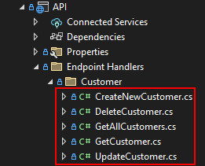

# Minimal API/Composition Root and Dynamic Endpoint Creation

In .NET 6, a new feature called Minimal APIs was introduced. This allows us to create an API with minimum code and no controller classes. The part that I did not like about was that all the examples that I found declared the handler in the API startup code as shown below. This seemed messy to me and would not scale especially once you start adding validation and error handling.

```
// Add new customer
app.MapPost(“/customers”, async ([FromBody] CustomerDto customerDto, [FromServices] ICustomerService customerService, HttpResponse response) =>
{
	var newCustomerDto = customerService.CreateNew(customerDto);

	response.StatusCode = 200;
	response.Headers.Location = $”customers/{newCustomerDto.Id}”;
})
.Accepts<CustomerDto>(“application/json”)
.Produces<CustomerDto>(StatusCodes.Status201Created);

```
Since another goal is to always loosely couple your API classes and services, I implemented the Composition Root pattern to initialize the dependency injection container with all the required services.

## Endpoint Handler ##

The EndpointHandler.Core assembly contains all of the code to dynamically find the endpoint handlers and wire them up as endpoints to the appropiate route. There are two methods to wire up the endpoints. 

### Initialization ###

The *WebApplicationBuilder* extension method, *AddEndpointHandlers()* is called to find all of the classes that implement the *IEndpointHandler* interface in the API assembly and adds them to the dependency injection container.

The *WebApplication* extension method, *MapEndpoints()* is called to create the endpoint mapping similar to the code above using the method attributes. 

```
    var builder = WebApplication.CreateBuilder(args);

    // Add services to the container.
    options?.Invoke(builder.Services);

    builder.AddEndpointHandlers();

    _app = builder.Build();
    
    .
    .
    .

    _app.MapEndpoints();
```
### Endpoint Handler Interfaces ###

The IEndpointHandler interfaces are a set of generic interfaces that enforce strong typing for parameter and responses. The interface only has one method, *Handle()* which is the method called when the API is invoked. Then *Handle()* methods only vary by the number of parameters passed to them. This pattern can be extended to any number of parameters, but may become unwieldy.

In the example code, all the responses are IResult types.

```
    public interface IEndpointHandler<TResponse>
    {
        TResponse Handle();
    }

    public interface IEndpointHandler<T1, TResponse>
    {
        TResponse Handle(T1 param1);
    }

    public interface IEndpointHandler<T1, T2, TResponse>
    {
        TResponse Handle(T1 param1, T2 param2);
    }

    public interface IEndpointHandler<T1, T2, T3, TResponse>
    {
        TResponse Handle(T1 param1, T2 param2, T3 param3);
    }

    public interface IEndpointHandler<T1, T2, T3, T4, TResponse>
    {
        TResponse Handle(T1 param1, T2 param2, T3 param3, T4 param4);
    }

    public interface IEndpointHandler<T1, T2, T3, T4, T5, TResponse>
    {
        TResponse Handle(T1 param1, T2 param2, T3 param3, T4 param4, T5 param5);
    }
```
### Endpoint Handler Base Classes ###

For each *IEndpointHandler* interface above there is a corresponding abstract *EndpointHandlerBase* class that implements it. In addition to the interface method, these classes also implement a *Validate()* method that can be overridden. Validation should occur before call any other services to validate the input from the client. If validation fails, a *ValidationException* should be thrown.

You will notice that the single input parameter variant class has the *Validate()* method inplemented to use a *IValidator<T1>* class from [FluentValidation](https://docs.fluentvalidation.net/en/latest/) which will also be injected into the class from the DI containter.
```
public abstract class EndpointHandlerBase<TResponse> : IEndpointHandler<TResponse>
    {
        public abstract TResponse Handle();
    }

    public abstract class EndpointHandlerBase<T1, TResponse> : IEndpointHandler<T1, TResponse>
    {
        private IValidator<T1>? _validator;

        public EndpointHandlerBase()
        {
        }

        public EndpointHandlerBase(IValidator<T1> validator)
        {
            _validator = validator;
        }

        public abstract TResponse Handle(T1 param1);

        protected virtual void Validate(T1 param1)
        {
            if (_validator != null)
            {
                var result = _validator.Validate(param1);

                if (!result.IsValid)
                {
                    throw new ValidationException(result.Errors);
                }
            }
        }
    }

    public abstract class EndpointHandlerBase<T1, T2, TResponse> : IEndpointHandler<T1, T2, TResponse>
    {
        public abstract TResponse Handle(T1 param1, T2 param2);
        protected virtual void Validate(T1 param1, T2 param2) { }
    }

    public abstract class EndpointHandlerBase<T1, T2, T3, TResponse> : IEndpointHandler<T1, T2, T3, TResponse>
    {
        public abstract TResponse Handle(T1 param1, T2 param2, T3 param3);
        protected virtual void Validate(T1 param1, T2 param2, T3 param3) { }
    }

    public abstract class EndpointHandlerBase<T1, T2, T3, T4, TResponse> : IEndpointHandler<T1, T2, T3, T4, TResponse>
    {
        public abstract TResponse Handle(T1 param1, T2 param2, T3 param3, T4 param4);
        protected virtual void Validate(T1 param1, T2 param2, T3 param3, T4 param4) { }
    }

    public abstract class EndpointHandlerBase<T1, T2, T3, T4, T5, TResponse> : IEndpointHandler<T1, T2, T3, T4, T5, TResponse>
    {
        public abstract TResponse Handle(T1 param1, T2 param2, T3 param3, T4 param4, T5 param5);
        protected virtual void Validate(T1 param1, T2 param2, T3 param3, T4 param4, T5 param5) { }
    }
```
### Endpoint Classes ###

Endpoint handler classes are all derived from one of the *EndpointHandlerBase* classes. I choose to organize them on a class per HTTP verb basis. In other words there are separate handler classes for GET/POST/PUT/DELETE as shown below. This will allow the developer to focus on the specific handler and should make testing easier. It may also facilitate implementing the [CQRS](https://www.martinfowler.com/bliki/CQRS.html) pattern.



Below is an example of a GET API to retrieve all customers. Since this may return a large number of customers, there are paging parameters being passed into the method. There parameters are validated in the overridden *Validate()* method. 

```
 public class GetAllCustomers : EndpointHandlerBase<int?, int?, IResult>
    {
        private ICustomerService _service;

        public GetAllCustomers(ICustomerService service)
        {
            _service = service;
        }

        [HttpGet]
        [Route("/customers")]
        [ProducesResponseType(typeof(CustomerDto), StatusCodes.Status200OK)]
        [ProducesResponseType(StatusCodes.Status204NoContent)]
        [Tags("Customer")]
        public override IResult Handle([FromQuery(Name = "offset")]int? offset, [FromQuery(Name = "count")]int? count)
        {
            Validate(offset, count);

            var dtos = _service.GetAll(offset, count);

            return dtos != null ? Results.Ok(dtos) : Results.NoContent();
        }

        protected override void Validate(int? offset, int? count)
        {
            var errors = new List<ValidationFailure>();

            if (offset < 0)
            {
                errors.Add(new ValidationFailure(nameof(offset), $"Offset cannot be negative!"));
            }

            if (count < 1)
            {
                errors.Add(new ValidationFailure(nameof(count), $"Count must be greater than zero!"));
            }

            if (errors.Count > 0)
            {
                throw new ValidationException(errors);
            }
        }
    }
```
The example below is for a POST API that uses a validator. Notice that the validator is injected into the constructor and the *Validate()* method is <u>not</u> overridden.

```
    public class CreateNewCustomer : EndpointHandlerBase<CreateCustomerCommand, IResult>
    {
        private ICustomerService _service;

        public CreateNewCustomer(ICustomerService service, IValidator<CreateCustomerCommand> validator) : base(validator)
        {
            _service = service;
        }

        [HttpPost]
        [Route("/customers")]
        [Tags("Customer")]
        public override IResult Handle([FromBody] CreateCustomerCommand cmd)
        {
            // This method will throw an exception on a validation error
            Validate(cmd);

            var dto = _service.CreateNewCustomer(cmd);

            return Results.Ok(dto);
        }
    }
```

## CQRS ##

The [CQRS](https://www.martinfowler.com/bliki/CQRS.html) pattern is not implemented in this project but could easily be adapted by simply splitting the commands and queries into separate assemblies.

## Validation ##
Validation is implemented using the excellent [FluentValidation](https://docs.fluentvalidation.net/en/latest/) package for command APIs since they send a command class in the API body. Other validation is handled by overriding the **Validate** method in the handler class.

